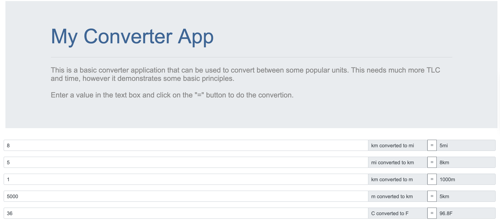

# Converter App
Angular web application can be found converter-app folder. Spring Boot application can be found in converter-services application.

## Spring Boot App
A basic Spring Boot application using an embedded H2 database, in the real world this will be replaced with an external RDBMS. The application uses Flyway to create the required table and insert data into it. A JPA repository manages the data access.

Their is a small business layer that does the convertion operations and REST controller manages the REST api.
Basic documentation for the API is provided using swagger and can be accessed at:
* http://localhost/converter/swagger-ui.html
* http://localhost/converter/v2/api-docs

The project has good test coverage using Spring test support and Mockito. I know EasyMock much better and there is a couple of things I would still like to review around the use of Mockito in the test classes.

docker-compose.yml at root can build the docker image, if the mvn clean install was run. Use docker-compose up --build to replace existing image.
mvn clean install dockerfile:build will also build the docker image.

## Angular App
A basic one page Angular app is provided written in Angular 7. This is the area of the project that still needs the most improvement. At the moment the unit tests are failing, but I just did not have the time to fix these.

